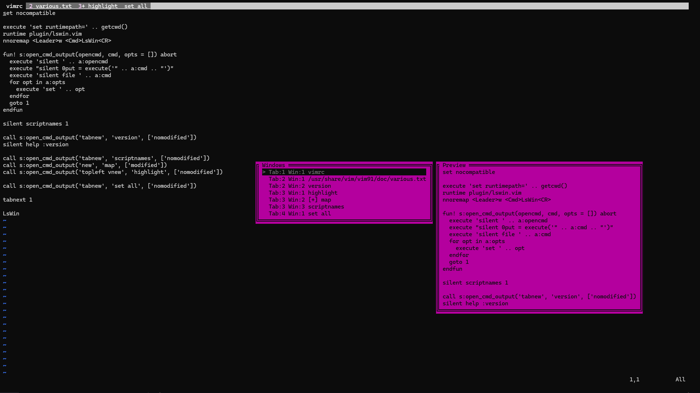

# lswin



A Vim plugin to list all windows across all tabs and jump to the selected one.

## Features

- List all windows across all tab pages
- Preview buffer contents as you move the cursor
- Jump to the selected window with Enter

## Entry Format

```
> Tab:1 Win:2 [+] plugin/lswin.vim
```

| Element | Description |
|---------|-------------|
| `>` | Current window |
| `Tab:N` | Tab number |
| `Win:N` | Window number within the tab |
| `[+]` | Unsaved changes |
| `[No Name]` | Unnamed buffer |

## Installation

### vim-plug

```vim
Plug 'bnnkw/lswin'
```

## Usage

```vim
:LsWin
```

## Mapping Example

```vim
nnoremap <Leader>w <Cmd>LsWin<CR>
```

## Key Bindings

Based on `popup_filter_menu()`.

| Key | Action |
|-----|--------|
| `j` / `<Down>` / `<C-n>` | Select item below |
| `k` / `<Up>` / `<C-p>` | Select item above |
| `<Space>` / `<Enter>` | Accept selection and jump |
| `x` / `<Esc>` / `<C-c>` | Cancel |

## Requirements

- Vim 9.0+ with +popupwin
